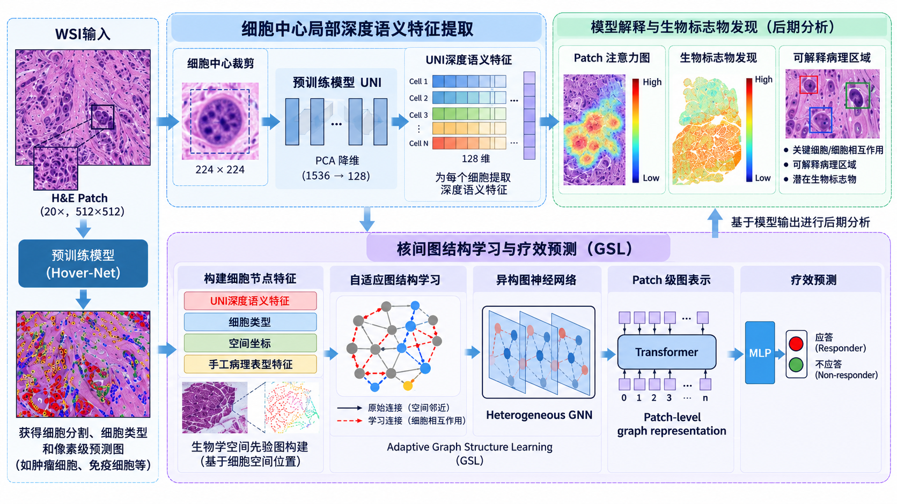

# Adaptive Spatial Graph Learning

一个基于 **PyTorch Geometric** 的空间关系建模工程。当前任务以多尺度全视野病理图像（WSI）图为载体，将细胞类型、形态特征、空间坐标和邻接关系编码为图结构，通过可切换的 GAT/EGAT/GCN、注意力池化和 Transformer 完成患者级预测，并提供节点、边与空间模式解释工具。

这份仓库整理自实际研究代码。数据和模型权重不公开；配置中的本地路径已经替换为相对路径。

## 与具身智能的关系

工程的直接应用是数字病理，核心方法是可复用的空间图学习：把对象视为节点、空间邻接视为边、对象类别与视觉表征视为节点属性，再进行关系推理。这一表示方式可以迁移到机器人场景图、物体关系建模和语义地图中的目标推理。仓库不把现有医学实验包装成机器人导航实验。

<p align="center">
  
</p>

<p align="center"><sub>完整算法流程图来自作者提供的博士申请答辩材料。</sub></p>

## 主要功能

- 在同一层实现 GAT、带距离权重的 EGAT、GCN 与 weighted GCN，通过 YAML 开关完成消融实验。
- 融合细胞类型、形态特征、二维坐标与图拓扑，支持多 Patch 层次化聚合。
- 使用门控注意力池化和二维位置编码 Transformer 建模跨区域关系。
- 提供训练、外部测试、断点续训、早停、指标记录与可解释性分析。
- 支持节点丢弃与特征噪声增强，并在节点丢弃时同步重建子图边索引。

## 目录

```text
.
├── configs/full_experiment.yaml  # 实验与消融开关
├── data/
│   ├── dataset.py                # 图数据读取与清洗
│   └── transforms.py             # 图增强
├── models/
│   ├── layers.py                 # 通用异构空间消息传递层
│   └── network.py                # GNN + Transformer 主网络
├── utils/                        # 指标、绘图、配置和检查点
├── main.py                       # 训练入口
├── test.py                       # 外部队列测试
└── interpret.py                  # 节点/边/空间模式分析
```

## 数据格式

每个病例对应一个目录，目录中包含若干 PyG `Data` 图对象：

```text
data/graphs/
└── case_001/
    ├── patch_001.pt
    └── patch_002.pt
```

每个图至少包含：

- `x`: `[num_nodes, num_features]` 节点特征；默认前 167 维为形态/深度特征。
- `edge_index`: `[2, num_edges]` 图连接。
- `cell_type`: `[num_nodes]` 节点类别。
- `pos`: `[num_nodes, 2]` 二维空间坐标，用于边权重与位置编码。

标签文件格式见 `data/labels.example.csv`，实际标签文件应保存为 `data/labels.csv`。

## 安装与运行

```bash
python -m venv .venv
# Windows: .venv\Scripts\activate
# Linux/macOS: source .venv/bin/activate
pip install -r requirements.txt
python main.py --cfg configs/full_experiment.yaml
```

外部测试：

```bash
python test.py \
  --cfg configs/full_experiment.yaml \
  --ckpt outputs/full_experiment/best_model.pth \
  --data_dir /path/to/test/graphs \
  --label_file /path/to/test/labels.csv
```

通过命令行覆盖配置可快速完成消融，例如关闭注意力：

```bash
python main.py --cfg configs/full_experiment.yaml model.use_attention false
```

## 说明

- 训练数据、病例标识、模型权重和结果文件均未包含在仓库中。
- 公开版本移除了原电脑中的绝对路径，并修复了默认配置、训练日志字段及 DropNode 边索引同步问题。
- 作者：Lijun Jin / 金利军（GitHub: [June027](https://github.com/June027)）
